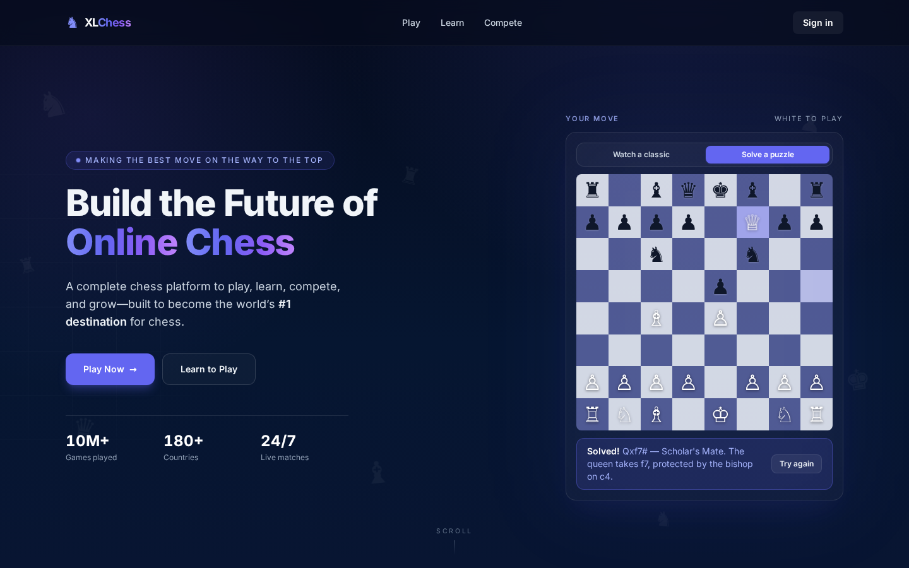

# XLChess — Hero Section

A recreation-plus-improvement of the [xlchess.com](https://xlchess.com) homepage
hero, built for the Stage 2 Full-Stack Web Developer assessment.

**Live demo:** https://xlchess.lonedetective.moe/
**Approach:** Option 2 — a faithful recreation of the existing hero, with
thoughtful, production-minded improvements layered on top.



## Overview

The hero recreates the signature elements of the live site — the deep-navy
gradient canvas, the indigo/violet brand accent, the gradient headline, and the
right-hand chessboard panel — and extends them:

- **Two classic games** replay move by move ("The Evergreen Game", 1852 and
  "The Opera Game", 1858) with square highlighting, gliding piece animation,
  a live move ticker, playback controls (pause / restart / 1x–2x speed), and a
  switcher to cycle between classics.
- **A playable puzzle** — a second tab challenges the visitor with a mate-in-one
  (click a piece, click its destination), with wrong-move feedback, a solve
  animation, and an explanation.
- **A designed motion system** — word-by-word headline reveal, drifting ghost
  pieces (an homage to the original site), count-up stats, a resting 3D tilt on
  the board card, and a shine sweep on the primary CTA. Every effect is
  transform/opacity-only and fully disabled under `prefers-reduced-motion`.
- **Production details** — branded loading screen, error boundary with a
  diagnosable fallback, fail-fast data validation, skip-to-content link with
  real focus handoff, unit tests, and CI.

---

## Setup and installation instructions

Requires **Node.js 20+** and npm.

```bash
# 1. Install dependencies
npm install

# 2. Start the dev server (http://localhost:5173)
npm run dev

# 3. Run the unit test suite (10 tests)
npm test

# 4. Type-check and create a production build (outputs ./dist)
npm run build

# 5. Preview the production build locally
npm run preview
```

### Deployment

`npm run build` emits a fully static `./dist` folder. The demo is deployed on
**Vercel** (Add New → Project → import the repo; Vite is auto-detected with
build command `npm run build` and output directory `dist`), but any static
host works identically — no server runtime is required. The page uses only
in-page anchors, so no SPA rewrite rule is needed.

### Continuous integration

`.github/workflows/ci.yml` runs the test suite, type-checking, and the
production build on every push and pull request.

---

## Technologies and libraries used

| Technology                    | Role       | Why it was chosen                                                              |
| ----------------------------- | ---------- | ------------------------------------------------------------------------------ |
| **Vite 7**                    | Build tool | Matches the original site's stack; fast dev server, small static output.       |
| **React 19 + TypeScript**     | UI         | Component architecture with strict type safety across data and props.          |
| **Tailwind CSS 3**            | Styling    | Design tokens sampled from the live site live in one config (`tailwind.config.ts`). |
| **Framer Motion 12**          | Animation  | Declarative entrance/stagger animation; respects reduced motion out of the box. |
| **Vitest 4**                  | Testing    | Unit tests for board coordinate math and bundled-data integrity.               |
| **GitHub Actions**            | CI         | Tests + type-check + build on every push.                                      |
| **python-chess** (build-time) | Data       | Game and puzzle positions are generated and engine-verified from real PGN — nothing hand-typed, and no chess engine ships in the bundle. |

---

## Design decisions

- **Option 2, not a redesign.** The site is the company's own product with an
  established brand. Recreating it faithfully and improving it respectfully
  demonstrates more judgement than discarding a working identity.
- **Design tokens sampled from the source.** Colors (`#050B1D`, `#6366f1`,
  `#8b5cf6`, `#c084fc`), the Inter typeface, and the gradient headline are taken
  from the live site's CSS so the recreation is accurate rather than approximate.
- **The board is the centrepiece.** The most memorable part of the original hero
  is the live game, so it received the most engineering care: engine-verified
  move data, gliding piece animation, playback controls, a game switcher, and a
  reduced-motion fallback (final position, no autoplay).
- **Retention thinking.** A hero's underlying job is acquisition and engagement.
  The puzzle tab turns a passive visitor into a player within seconds; the
  replay controls invite a first interaction; the primary CTA is singular.
- **Precomputed positions, no engine in the bundle.** The games are converted to
  8×8 position frames at build time, so the client just renders frames —
  deterministic animation and a smaller bundle.
- **State isolation via `key`.** Each game's replay is remounted with a React
  `key`, making stale-index bugs across games structurally impossible (a
  defensive clamp backs this up — that exact bug shipped once during
  development and is documented in the code).
- **Static tilt, deliberately.** Two tilt iterations were rejected — a
  pointer-tracking tilt and a flatten-on-hover — because any transform that
  reacts to the pointer moves click targets while the user is aiming at them,
  and `transform-style: preserve-3d` was found to corrupt browser hit-testing.
  The final card tilts statically and flattens only on keyboard focus. The
  reasoning is preserved in comments in `TiltCard.tsx` and `index.css`.

## Assumptions made

- The Evergreen Game matches the game shown on the live site; the Opera Game
  was added as a second classic. Any PGN can be converted into the same JSON
  shape and dropped into `src/data/`.
- Copy and stat figures (10M+ games, 180+ countries) are representative
  placeholder marketing numbers, not audited metrics.
- Only the hero is in scope, so nav links and CTAs point to in-page anchors
  rather than real routes.
- The puzzle is a curated one-move challenge, not a full chess engine — it
  accepts exactly the winning move by design.

## Trade-offs considered

- **No analytics.** Measurement (e.g. GA4 on CTA clicks and board interactions)
  belongs on the real production page, but was deliberately left out of this
  component demo to keep it dependency-free and privacy-clean. The natural hook
  points are the CTA `onClick`s and the board control handlers.
- **Framer Motion adds ~30 KB gzipped** but replaces substantial hand-written
  animation code and provides reduced-motion handling for free — worthwhile for
  a marketing page; the piece-flight animation is pure CSS where determinism
  mattered more.
- **Static output (no SSR)** fits a fully static hero. If the page later needs
  per-request data or dynamic OG images, it can move to an SSR-capable setup.
- **Single winning move in the puzzle** rather than full legal-move validation —
  a scope cut that keeps the bundle free of a chess engine while still
  delivering real interaction; the data-accessor pattern makes swapping in
  chess.js straightforward later.
- **Unicode glyph pieces** instead of SVG piece sets — zero asset weight and
  crisp at every size, at the cost of minor cross-platform font differences.

## What I would improve if given additional time

- **Full drag-and-drop play** with legal-move validation (chess.js) and a
  rotating daily puzzle — the strongest retention mechanic on this surface.
- **Playwright end-to-end tests in CI** (tab switching, puzzle solving,
  game switching mid-replay) on top of the existing unit suite — several bugs
  found during development were state-transition bugs that only E2E catches.
- **Analytics** wired to the existing hook points once a measurement plan exists.
- **A generated Open Graph image** per deployment and richer social cards.
- **Internationalisation** and a reduced-data mode.
- **Real routes** for the CTAs once the surrounding application exists.

---

## Project structure

```
src/
  components/
    Header.tsx         # sticky nav + brand mark
    Hero.tsx           # headline, copy, CTAs, stats (staged entrance)
    BoardPanel.tsx     # tabbed card: replay / puzzle, owns game selection
    BoardGrid.tsx      # shared presentational 8x8 board (optionally interactive)
    ReplayBoard.tsx    # classic-game replay + playback controls
    PuzzleBoard.tsx    # mate-in-one interaction (select piece -> destination)
    TiltCard.tsx       # resting 3D tilt (static under pointer, by design)
    FloatingPieces.tsx # decorative drifting background pieces
    CountUpStat.tsx    # stat that counts up when scrolled into view
    LoadingScreen.tsx  # branded first-paint splash
    ErrorBoundary.tsx  # branded crash fallback that surfaces the error message
  data/
    games.ts           # both classics, shared fail-fast validation
    evergreen.json     # Evergreen Game positions (from real PGN)
    opera.json         # Opera Game positions (from real PGN)
    puzzle.json        # engine-verified mate-in-one position
    puzzle.ts          # typed accessor with fail-fast validation
  __tests__/
    board.test.ts      # coordinate math + data-integrity tests (10 tests)
  App.tsx              # skip link, layout shell
  main.tsx             # entry, error boundary wiring
  index.css            # Tailwind layers, gradient bg, motion keyframes, a11y utilities
```
